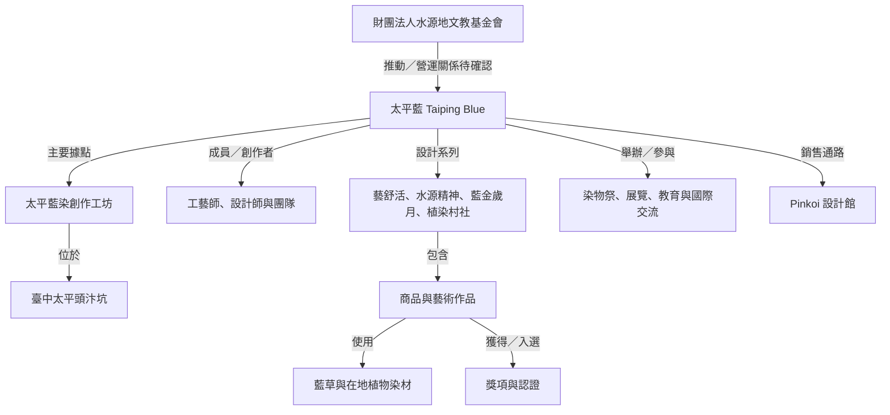
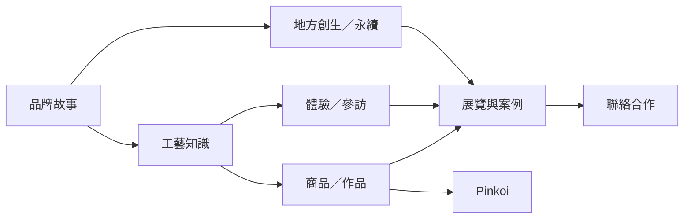

# 太平藍 Taiping Blue 官方網站整合企劃書

> 文件版本：v1.0（2026-08-14）  
> 主要語言：繁體中文（臺灣）  
> 文件用途：學生專題需求文件、內容盤點表、網站 IA、線框稿依據、資料庫欄位與前端開發 backlog  
> 資料狀態標記：**已完成**＝有簡報影像或外部來源支持；**進行中**＝來源明示仍在辦理；**未來規劃**＝來源明示為願景或計畫；**[待企業確認]**＝有缺漏、衝突或可能變動。

## 0. 研究範圍、使用原則與來源限制

本企劃已逐頁檢視 243 頁品牌簡報《客家藍染品牌太平藍之路》，並比對太平藍 Facebook、Pinkoi、水源地文教基金會官網、臺北時裝週品牌資料庫、文化部與近期公開報導。LaLaport 台中只用來分析「分類、搜尋、篩選、語言切換與手機查找」的互動邏輯，不複製其版面、程式碼或視覺素材。

Facebook 公開頁面可讀到品牌簡介、類別、地址、電話、Pinkoi 連結與追蹤人數，但貼文串仍受登入限制；因此本企劃不把未完整讀取的 Facebook 貼文當作活動事實來源。Pinkoi 的商品數、銷量、追蹤數與價格會隨時變動，僅作為盤點快照，正式網站不硬編這些數字。

主要公開來源：

- [太平藍 Facebook](https://www.facebook.com/Taipingblue/)
- [太平藍 Pinkoi 設計館](https://www.pinkoi.com/store/taiping-blue)
- [Mitsui Shopping Park LaLaport 台中](https://www.mitsui-shopping-park.com.tw/lalaport/taichung/tw/index.html)（僅作資訊架構與互動參考）
- [水源地文教基金會：Taiping Blue 太平藍](https://www.youngwater.org.tw/taiping-blue-%E5%A4%AA%E5%B9%B3%E8%97%8D)
- [水源地文教基金會：植物染](https://www.youngwater.org.tw/%E6%A4%8D%E7%89%A9%E6%9F%93)
- [臺北時裝週品牌資料庫：Taiping Blue](https://tpefw.design/zh-tw/Page/Index/163)
- [文化部：太平藍獲 IFFS Best Décor Award](https://www.moc.gov.tw/global_outreach/News_Content2.aspx?n=534&s=19972)
- [Google：生成式 AI 搜尋最佳化指南](https://developers.google.com/search/docs/fundamentals/ai-optimization-guide)
- [Google：多語與多地區網站](https://developers.google.com/search/docs/specialty/international/managing-multi-regional-sites)
- [Google：結構化資料一般規範](https://developers.google.com/search/docs/appearance/structured-data/sd-policies)

---

## 1. 專案定位摘要

### 1.1 一句話定位

太平藍官方網站是以臺中太平頭汴坑為入口，整合品牌、客家藍染知識、作品、體驗、地方創生與國際交流的「官方品牌與工藝導覽平台」。

### 1.2 不是什麼

網站不是另一個 Pinkoi，也不以購物車作為首頁主軸。商品頁負責說清楚作品、材料與工藝，再把有購買意圖的訪客導向 Pinkoi；需要客製、大宗採購、策展或教育合作的人，則導向官方洽詢表單。

### 1.3 核心任務與 KPI

| 任務 | 使用者得到什麼 | 第一階段 KPI | 主要轉換 |
|---|---|---:|---|
| 建立官方事實入口 | 找到一致、可引用的品牌資料 | 品牌核心頁 100% 有來源與更新日期 | 品牌頁深度瀏覽 |
| 說明工藝 | 用一般人看得懂的方式認識藍染 | 8 篇核心知識頁上線 | 知識頁→體驗／商品 |
| 展示作品 | 理解作品故事，不只看到照片 | 12–20 筆代表作品完成欄位 | Pinkoi 外連、合作洽詢 |
| 導入體驗與參訪 | 快速找到適合的體驗方式 | 預約流程、資格、注意事項完整 | 預約送出、地圖點擊 |
| 支援國際交流 | 提供英文／日文可引用資料 | 10 個優先頁完成 EN／JA | 國際合作表單 |
| 支援現場導覽 | 掃 QR 後三次點擊內找到重點 | QR 首屏 LCP < 2.5 秒 | QR 導覽完成、分享 |

### 1.4 目標受眾、搜尋意圖與轉換路徑

| 受眾 | 主要問題／搜尋意圖 | 首選入口 | 建議路徑 | 最終 CTA |
|---|---|---|---|---|
| 臺灣消費者、文創愛好者 | 太平藍是什麼？有哪些商品？ | 首頁／商品 | 品牌→工藝→商品 | 前往 Pinkoi 購買 |
| 國內外旅客 | 台中哪裡能體驗藍染？怎麼去？ | 體驗／Visit | 體驗→預約→交通 | 預約藍染體驗 |
| 工藝與永續關注者 | 使用什麼染材？如何減少浪費？ | 知識庫／永續 | 材料→流程→案例 | 閱讀案例／訂閱更新 |
| 博物館、藝廊、策展人 | 有哪些作品與國際展歷？ | 國際交流／作品 | 策展紀錄→作品→團隊 | 提出策展邀請 |
| 企業 ESG／採購 | 能否做禮贈品、團隊活動？ | 企業合作 landing page | 案例→服務→需求表 | 洽詢企業合作 |
| 學校、教師、研究者 | 有哪些課程與可引用資料？ | 教育合作／知識庫 | 教材→課程→來源 | 洽詢校園課程 |
| 設計師、藝術家、青年 | 是否接受跨域合作？ | 合作案例 | 作品→案例→合作規格 | 提交合作提案 |
| 媒體、地方創生研究者 | 組織、年份、成果是否可查證？ | 媒體中心／品牌時間軸 | 事實表→下載區→聯絡 | 媒體採訪洽詢 |

### 1.5 品牌語氣與視覺原則

- 語氣：專業、具體、有人文溫度；先說事實，再談意義。
- 用字：臺灣繁體中文；使用「資訊、影片、品質、網路、軟體、計畫」，避免中國用語。
- 視覺：靛藍、藍靛沉澱漸層、米白、麻布、自然木色；照片優先於裝飾插圖。
- 圖像：只使用已授權的真實作品、工藝過程、團隊、活動與環境照片。
- 動效：只服務於導覽與狀態回饋；不以大量視差或 WebGL 搶走內容主角。

---

## 2. 從資料來源整理出的品牌事實表

### 2.1 核心品牌與組織事實

| 事實／實體 | 目前可寫內容 | 狀態 | 來源與證據 | 網站處理 |
|---|---|---|---|---|
| 品牌名稱 | 太平藍／Taiping Blue | 已完成 | 簡報、Facebook、Pinkoi、基金會官網一致 | 全站固定字典，不自行變形 |
| 品牌性質 | 由水源地文教基金會推動的臺中客家藍染社區產業品牌 | 已完成 | 基金會官網、Facebook、文化部資料 | 太平藍與基金會分成兩個實體頁，再以關係連結 |
| 創立地點 | 臺中市太平區頭汴坑 | 已完成 | Facebook、基金會官網、文化部與 Pinkoi 故事一致 | 品牌頁、Place 頁、About 直接答案段落 |
| 創立年份 | 多數來源寫 2012；臺北時裝週資料庫寫 2013；Pinkoi 顯示 2014 開館 | [待企業確認] | 來源互相矛盾 | 未確認前首頁不寫年份；時間軸註明差異 |
| 品牌目的 | 保存與推廣藍染工藝、以設計轉化為現代用品、創造地方培力與就業 | 已完成 | Facebook、基金會官網、簡報 | 品牌核心價值、永續與地方創生頁 |
| 主要染材 | 藍草；公開報導另提馬藍、木藍；簡報與近期報導有枇杷、龍眼、荔枝等在地植物／農業剩餘資源 | 已完成／部分待確認 | 簡報、文化部、2026 公開報導 | 每種染材獨立 DefinedTerm，批次與來源需作品層級確認 |
| 基金會正式名稱 | 財團法人水源地文教基金會 | 已完成 | 簡報、基金會官網 | Organization 實體；不得把基金會獎項全改寫成品牌獎項 |
| 基金會成立 | 官網寫 1998 年 5 月正式登記成立 | 已完成 | 基金會 About | 只放基金會頁，與太平藍創立年分開 |
| 工坊類別 | Facebook 列為「藝術與手工藝品店」 | 已完成 | Facebook About | 可作 LocalBusiness 補充類別，正式分類仍待企業確認 |
| 工作室地址 | 臺中市太平區長龍路四段 20 號 | [待企業確認] | Facebook 與工藝店公開手冊一致 | 與基金會辦公室分開；上線前由企業書面確認 |
| 基金會辦公室 | 臺中市北區育才街三巷三號三樓之四 | 已完成／使用前確認 | 基金會官網 | 僅標為基金會辦公室，不當成工作室交通地址 |
| 電話 | 04-2227-7826 | [待企業確認] | Facebook、基金會官網一致，但可能為基金會辦公電話 | 上線前確認用途、分機與可公開時段 |
| Email | watersource@mail2000.com.tw | [待企業確認] | 基金會官網 | 確認是否作品牌、預約及國際合作共用信箱 |
| 工作室開放時間 | 舊工藝手冊為週三至週日 09:00–18:00；基金會辦公室為週一至週五 09:00–18:00 | [待企業確認] | 不同實體、不同來源 | 不得合併；LocalBusiness 未確認前不輸出 openingHours |
| 主要銷售通路 | Pinkoi 設計館 | 已完成 | Facebook 與官網均連到 Pinkoi | 商品頁固定外連，帶 UTM／outbound event |
| Pinkoi 上架現況 | 2026 年 8 月公開快照約 15–18 項，語系快取有差異 | 進行中 | Pinkoi 頁面為動態資料 | 不在網站寫死商品總數、銷量、評分或價格 |

### 2.2 已可辨識的產品與作品分類

| 分類 | 簡報／官網／Pinkoi 已見項目 | 上線原則 |
|---|---|---|
| 隨身織品 | 手帕（大／中／小）、方巾、領巾、領帶、圍巾、絲巾 | 先核對目前仍販售與停產款；紋理差異需寫清楚 |
| 服飾帽飾 | T-shirt、藍衫、帽款系列 | 簡報中的設計概念與現售商品分開 |
| 居家餐桌 | 杯墊、餐墊、桌旗、掛簾、抱枕 | 每件補尺寸、材質、染法、保養與 Pinkoi 狀態 |
| 家具家飾 | 掛鐘／桌鐘、桌燈、椅凳、長椅、置物盒、提籃、組合櫃 | 多數較像代表作品；不可默認可購買 |
| 包袋配件 | 多款包袋、工作圍裙、嬰幼兒禮盒 | 核對現售／典藏／合作款狀態 |
| DIY／體驗 | 藍染方巾 DIY 套組、校園體驗、工作坊 | 活動服務與商品套組分開建模 |
| 主題系列 | 藝舒活、水源精神、藍色情調、藍金歲月 Indigo Deco、植染村社 | 各建系列頁，串聯作品、年份、材料與設計理念 |
| 藝術與共創 | 藝術家合作、學生合作、染物祭裝置、《協流共濟》、《流域記憶》 | 使用 ArtWork／CreativeWork 欄位，不放購買 CTA 除非企業確認 |

### 2.3 成果與活動事實帳（精選）

| 年份 | 事件／成果 | 關係歸屬 | 狀態 | 網站寫法 |
|---:|---|---|---|---|
| 2017 | 新加坡國際家具家飾展 IFFS 最佳裝飾獎（手工藝及工藝品類） | 文化部英文資料指出得獎者為水源地文教基金會，並以太平藍作品參展 | 已完成 | 寫清楚「基金會／太平藍作品」關係，不簡化成品牌唯一得主 |
| 2018 | 臺灣優良工藝品標章、金點設計獎標章 | 藍染產品 | 已完成／細項待確認 | 每一獎項需補產品名、證書與官方連結 |
| 2019 | 太平藍工藝師臺北國家文創禮品館聯展、中友百貨聯展 | 太平藍／工藝師 | 已完成 | 建活動頁與圖庫，補正式展名、日期、主辦 |
| 2020 | 承億文旅「日常的 12 種藍」技藝展／藝術客房 | 太平藍與承億文旅合作 | 已完成 | 建案例研究，不只放相簿 |
| 2021 | 臺北時裝週 AW21／SS、寶麗百貨與松菸策展、新光三越儀式生活節 | 太平藍 | 已完成 | 各活動獨立頁，修正季別命名後上線 |
| 2022 | 法國巴黎家具家飾展、美國雙橡園國慶日特展、美國臺灣形象展 | 太平藍 | 已完成 | 補正式邀請／主辦來源與展品清單 |
| 2023 | 帝國糖廠展覽、首屆頭汴坑染物祭、東京交流展 | 太平藍／基金會／合作單位 | 已完成 | 染物祭建立年度系列與主辦關係 |
| 2024 | 頭汴坑藝術季／染物祭、紐約「青色奔瀧」交流展 | 太平藍／基金會／合作單位 | 已完成 | 日期、場館與合作名單需企業確認 |
| 2025 | 臺中市文化局「染織山河」大展、加拿大臺灣節活動、韓國天然染色文化產品競賽特選 | 太平藍／作品 | 已完成 | 加拿大多倫多／溫哥華頁面分開，不共用錯誤標題 |
| 2026-01 | 大型藍染壁飾《協流共濟》進駐總統府會客室 | 太平藍團隊作品 | 已完成 | 可引用[中央社報導](https://www.cna.com.tw/news/acul/202601150231.aspx)，補設計與製作名單 |
| 2026-02 | 《流域記憶》入選第 12 屆義大利瓦爾切利納獎決選 19 件 | 太平藍團隊／設計師許家毓等 | 已完成 | 應寫「入選決選」，不可寫成得獎；參考[自由藝文報導](https://art.ltn.com.tw/article/breakingnews/5347948) |
| 2026-06 | 參與日本福島縣三島町第 40 屆故鄉會津工人祭 | 臺灣社區工藝代表之一 | 已完成 | 補 6 月 13–16 日交流行程與工藝中心來源 |
| 2026-07 | 洛杉磯「靛色的交響・洛杉磯工藝文化交流展」 | 太平藍、洛僑中心、大洛杉磯臺灣客家會 | 已完成 | 補 7 月 11–14 日、展覽／講座／體驗三種活動；參考[世界新聞網](https://www.worldjournal.com/wj/amp/story/121359/9623696) |

### 2.4 品牌價值提煉（不新增口號）

1. 在頭汴坑重新發展曾經消失於地方的客家藍染工藝。
2. 透過現代設計，讓染織工藝進入服飾、家居、家具與藝術創作。
3. 以社區培力、工藝師培訓與跨世代合作，創造工作與參與機會。
4. 使用藍草、在地植物與農業剩餘資源，發展天然染色與循環材料。
5. 以展覽、藝術教育、染物祭與國際交流，把地方工藝帶到更大的公共舞台。

---

## 3. 待企業確認事項清單

### 3.1 上線阻擋等級

| ID | 待確認事項 | 為何重要 | 負責人建議 | 阻擋頁面 | 驗收證據 |
|---|---|---|---|---|---|
| C-01 | 品牌正式創立年是 2012 或 2013？2014 是否只代表 Pinkoi 開館？ | 影響所有時間軸、Schema 與媒體資料 | 品牌窗口／基金會 | 首頁、About、媒體包 | 書面確認＋可公開來源 |
| C-02 | 太平藍的法律／組織定位：品牌、工作室、社會企業、基金會專案，哪些稱呼可正式使用？ | 避免錯誤宣稱法人身分 | 基金會主管 | 全站、Organization Schema | 組織說明文件 |
| C-03 | 太平藍與水源地文教基金會的品牌所有權、營運與聯絡關係 | 知識圖譜核心關係 | 基金會主管 | About、Contact | 一段核准文字 |
| C-04 | 工作室正式地址、地圖座標、無障礙入口、停車與大眾運輸 | 直接影響到訪安全 | 工作室窗口 | Visit、QR、LocalBusiness | 現場核對＋Google Maps |
| C-05 | 工作室與基金會辦公室的電話、Email、服務時段是否不同 | 避免旅客聯絡錯單位 | 行政窗口 | Contact、Footer | 聯絡矩陣 |
| C-06 | 現行開放日、營業時間、臨時休館規則、是否須預約 | 時效高，不能沿用舊手冊 | 工作室窗口 | Visit、FAQ、Schema | 最近核准公告 |
| C-07 | 藍染體驗類型、時間、人數、語言、費用、年齡、取消規則 | 不能把舊活動價當現價 | 體驗負責人 | Experiences、FAQ | 正式價目與 SOP |
| C-08 | 國外旅客是否有英／日語接待與預約方式 | 多語轉換核心 | 國際窗口 | EN／JA、QR | 可提供服務清單 |
| C-09 | 現售、缺貨、停產、典藏與可客製商品清單 | 商品頁不能混為可購買 | 商品負責人 | Products | 商品主檔匯出 |
| C-10 | 每件商品的尺寸、材質、染材、技法、保養與照片授權 | Product Schema 與信任度 | 商品／工藝師 | Product detail | 核准資料卡 |
| C-11 | Pinkoi 連結是否有各商品永久網址；是否可加 UTM | 追蹤與導流 | 電商窗口 | Product detail | 測試連結 |
| C-12 | 獎項應歸屬基金會、太平藍、個人或特定作品 | 避免不當擴張 | 品牌／法務 | Awards、Homepage | 證書／官方頁 |
| C-13 | 所有展覽正式名稱、日期、場館、主辦／協辦與展品 | Event Schema 需要精確資料 | 專案經理 | Events | 活動清冊 |
| C-14 | 團隊姓名、職稱、簡介、照片、在職狀態與英文／日文名 | Person Schema 與 E-E-A-T | 每位成員 | Team | 個人同意書 |
| C-15 | 「工藝師」認定與審稿者名單 | 工藝內容專業責任 | 品牌主管 | Knowledge base | 審稿制度 |
| C-16 | 作品與活動照片的著作權、攝影者、肖像與多語使用範圍 | 不可直接搬簡報圖 | 權利管理窗口 | 全站 | 授權台帳 |
| C-17 | 2026 及後續活動哪些已完成、進行中或未來規劃 | 防止時態誤植 | 專案經理 | Timeline、Events | 月度更新表 |
| C-18 | 個資告知、表單資料保存、Cookie／廣告同意策略 | GA4／Meta 與表單上線條件 | 指導老師＋企業 | Forms、Consent | 核准隱私政策 |
| C-19 | 簡報檔名標示「115.8.30」，晚於本次盤點日 2026-08-14；這是預定版本日、活動日期或誤植？ | 影響文件版本與 2026 事件判讀 | 簡報提供者 | 全站事實盤點 | 確認檔案版本日期 |

### 3.2 建議企業回填資料表

每一筆活動、商品、人物與獎項至少要有 `internal_id`、繁中／英文／日文名稱、狀態、開始與結束日期、摘要、完整說明、關係實體、來源 URL、來源檔案、照片授權、最後更新日、內容負責人、審稿者與公開權限。資料未完成時前端顯示「資訊整理中」，後台則顯示 `needs_confirmation=true`，不可把內部待辦文字公開給一般訪客。

---

## 4. GEO 與 SEO 策略藍圖

### 4.1 2026 年的 GEO 原則

Google 最新官方指南指出，生成式 AI 搜尋仍依賴既有搜尋索引、可爬取內容、清楚技術結構與對人有幫助的原創內容；不需要特殊 AI Schema，也不必把每段切得很碎。`llms.txt` 對 Google 搜尋的能見度沒有加分或扣分，不能取代 sitemap、robots.txt、canonical 與結構化資料。[Google 官方指南](https://developers.google.com/search/docs/fundamentals/ai-optimization-guide)

太平藍的 GEO 重點不是堆關鍵字，而是建立一套「可被引用的官方事實系統」：

1. **每個實體有固定頁面與固定名稱**：品牌、基金會、工作室、頭汴坑、人物、系列、作品、活動、獎項各有 canonical URL。
2. **開頭先直接回答**：知識頁前 40–80 字回答「是什麼／在哪裡／怎麼參加」，後面再補脈絡、照片、來源與日期。
3. **把主張綁到來源**：每一個年份、獎項、展覽與材料主張，至少有一個官方文件、證書、活動頁或可公開媒體來源。
4. **關係一致**：獎項屬於基金會、品牌、個人還是作品，資料庫與頁面都必須明寫。
5. **保留修訂脈絡**：顯示作者、工藝審稿者、更新日、資料來源與修訂紀錄。
6. **提供原創證據**：真實工藝流程、材料批次、作品細節與社區合作紀錄，比彙整網路常識更有引用價值。
7. **跨站名稱一致**：官網、Facebook、Instagram、Pinkoi、Google Business Profile、展覽名錄與新聞稿使用同一組正式名稱、英文名、地址與短介。

### 4.2 重要實體與獨立頁面

| 實體 | 建議 URL | 必要內容 | 與其他實體關係 |
|---|---|---|---|
| 太平藍 Taiping Blue | `/zh-hant/about/taiping-blue/` | 定義、定位、年份差異、品牌價值、sameAs | `brandOf` 基金會；`location` 工作室 |
| 水源地文教基金會 | `/zh-hant/about/watersource-foundation/` | 正式名稱、成立、服務範圍、太平藍關係 | `owns/operates` ［待確認］ |
| 太平藍染創作工坊 | `/zh-hant/visit/studio/` | 地址、交通、開放、預約、無障礙 | `containedInPlace` 頭汴坑 |
| 頭汴坑 | `/zh-hant/places/toubiankeng/` | 地方背景、客家文化、地圖、相關案例 | `homeLocation` 品牌 |
| 工藝師／團隊 | `/zh-hant/people/{slug}/` | 真名、職稱、專長、作品、審稿範圍 | `memberOf`、`creator` |
| 商品／作品 | `/zh-hant/products/{slug}/`、`/works/{slug}/` | 材料、技法、尺寸、故事、狀態 | `isPartOf` 系列；`creator` 人物 |
| 設計系列 | `/zh-hant/collections/{slug}/` | 年份、概念、代表作品 | 藝舒活、水源精神等 |
| 展覽／活動 | `/zh-hant/events/{year}/{slug}/` | 日期、場館、主協辦、狀態、作品 | `organizer`、`location`、`workFeatured` |
| 獎項／認證 | `/zh-hant/recognition/{slug}/` | 頒獎單位、年份、對象、證據 | `recipient` 必須精確 |
| 染材／技法術語 | `/zh-hant/glossary/{slug}/` | 40–80 字定義、別名、來源 | DefinedTermSet |

### 4.3 直接答案型段落範本

> **太平藍是什麼？**  
> 太平藍（Taiping Blue）是由財團法人水源地文教基金會推動、在臺中太平頭汴坑發展的客家藍染社區產業品牌，透過天然染色、產品設計、工藝教育與地方合作，讓藍染進入當代生活。

> **太平藍位於哪裡？**  
> 太平藍染創作工坊位於臺中市太平區頭汴坑；公開資料所列地址為長龍路四段 20 號，但參訪地址、開放時間、停車與預約方式仍應以品牌最新公告為準。[待企業確認]

> **客家藍染與一般染色有何不同？**  
> 客家藍染以藍草製成的天然染料反覆浸染，並透過綁、縫、夾、型糊等防染方式形成藍白紋理。它不只處理顏色，也連結客家生活、地方材料與手工製作過程。

> **太平藍如何實踐地方創生？**  
> 太平藍以頭汴坑的文化與植物材料為基礎，投入工藝培訓、青年與中高齡參與、校園教育、社區共創及染物祭，讓工藝成果回到地方，並透過商品與展覽創造工作及合作機會。

> **太平藍有哪些商品與體驗？**  
> 公開資料可確認的品項包括手帕、圍巾、絲巾、領帶、帽飾、餐墊、杯墊、桌旗、掛鐘與桌燈等；另有藍染 DIY、校園課程及團體活動。現售品項與體驗方案請以最新頁面為準。

> **如何預約太平藍的藍染體驗？**  
> 目前公開資料顯示太平藍曾提供校園與團體藍染課程，但工作室常態體驗的日期、人數、費用與語言服務仍待確認。網站上線前應建立正式預約表單與回覆時限。[待企業確認]

> **國外旅客如何認識或聯絡太平藍？**  
> 國外旅客可先閱讀英文或日文品牌、工藝與參訪頁，再透過國際詢問表單聯絡。是否提供英語、日語現場導覽及海外寄送，須由團隊確認後公告。[待企業確認]

### 4.4 內容可信度模板

每篇知識、案例與活動頁底部固定顯示：

```text
內容作者：［姓名／角色］
工藝審稿：［姓名／專長］
資料整理：［學生專題組／成員］
首次發布：YYYY-MM-DD
最後更新：YYYY-MM-DD
資料來源：［官方文件／活動頁／證書／訪談］
修訂紀錄：v1.1 修正活動日期；v1.2 補上作品材料
資訊狀態：已完成／進行中／未來規劃／待企業確認
```

---

## 5. 品牌知識圖譜與 Schema 規劃

### 5.1 建議知識圖譜關係



### 5.2 Schema 類型評估表

| Schema 類型 | 對應頁面 | 必填／建議欄位 | 資料來源 | 注意事項 |
|---|---|---|---|---|
| `Organization` | 基金會頁、首頁 graph | `name`、`url`、`logo`；建議 `sameAs`、`contactPoint`、`brand` | 基金會正式資料 | 太平藍若非獨立法人，不要把法律資訊掛在品牌上 |
| `LocalBusiness` | 工作室／Visit | `name`、`address`；建議 `geo`、`telephone`、`openingHoursSpecification` | 現場與企業核准資料 | 地址與時間未確認前不要輸出；基金會辦公室不可冒充工坊 |
| `Place` | 頭汴坑、展覽場館 | `name`；建議 `address`、`geo`、`containedInPlace` | 政府地圖／場館 | 不把整個頭汴坑當成單一商家地址 |
| `Person` | 團隊／工藝師頁 | `name`；建議 `jobTitle`、`knowsAbout`、`worksFor`、`sameAs` | 本人核准 | 需肖像、職稱與外文名同意 |
| `Product` | 現售商品頁 | `name`、`image`；建議 `description`、`material`、`brand`、`sku`、`offers` | 商品主檔、Pinkoi | 無確認價格就不放 `offers`；藝術作品改用 `CreativeWork` |
| `Service` | DIY、課程、參訪、企業服務 | `name`、`provider`；建議 `areaServed`、`audience`、`offers` | 體驗 SOP | 費用未確認就省略 `offers` |
| `Event` | 單一活動詳情頁 | `name`、`startDate`、`location`；建議 `endDate`、`eventStatus`、`organizer`、`image` | 活動清冊 | 每個活動需獨立 URL；營業時間不是 Event |
| `Article` | 知識與案例文章 | `headline`、`image`、`datePublished`、`author`；建議 `dateModified`、`reviewedBy` | CMS | 作者與審稿者需可點進人物頁 |
| `FAQPage` | FAQ 頁 | `mainEntity`、`Question`、`acceptedAnswer` | 已核准 FAQ | Google 多數商業網站不常顯示 FAQ rich result；仍可作語意標記但不承諾版位 |
| `HowTo` | 工藝流程／保養 | `name`、`step`；建議 `image`、`tool`、`supply` | 工藝師審稿 | Google 已停止 HowTo rich result，但其他系統仍可理解；不可教出未公開配方 |
| `BreadcrumbList` | 所有第二層以下頁 | `itemListElement`、`position`、`name`、`item` | IA 自動生成 | 與畫面可見麵包屑一致 |
| `ImageObject` | 作品／流程照片 | `contentUrl`、`caption`；建議 `creator`、`creditText`、`copyrightNotice` | 授權台帳 | 不使用生成圖假冒真實作品 |
| `VideoObject` | 工藝影片、訪談 | `name`、`thumbnailUrl`、`uploadDate`；建議 `duration`、`contentUrl`／`embedUrl` | 影音主檔 | 字幕、語言、授權與縮圖需齊全 |
| `DefinedTerm` | 染材、技法、名詞頁 | `name`、`description`、`inDefinedTermSet` | 工藝師審稿 | 別名與外文名建立同義詞欄位 |
| `DefinedTermSet` | 藍染辭典首頁 | `name`、`hasDefinedTerm` | CMS | 詞條數量可逐步擴充 |

JSON-LD 使用 JSON-LD 格式，但「有 Schema」不等於一定顯示 rich result；標記內容必須與頁面可見內容一致，並分別用 Rich Results Test 與 Schema Markup Validator 驗證。[Google 結構化資料規範](https://developers.google.com/search/docs/appearance/structured-data/sd-policies)

### 5.3 首頁 JSON-LD 範例

> 下列範例刻意省略未確認的電話、地址、營業時間與評價；`[待企業確認：正式網域]` 在開發時必須替換。

```json
{
  "@context": "https://schema.org",
  "@graph": [
    {
      "@type": "WebSite",
      "@id": "[待企業確認：正式網域]/zh-hant/#website",
      "url": "[待企業確認：正式網域]/zh-hant/",
      "name": "太平藍 Taiping Blue",
      "inLanguage": "zh-Hant-TW",
      "publisher": { "@id": "[待企業確認：正式網域]/zh-hant/#organization" }
    },
    {
      "@type": "Organization",
      "@id": "[待企業確認：正式網域]/zh-hant/#organization",
      "name": "財團法人水源地文教基金會",
      "url": "https://www.youngwater.org.tw/",
      "brand": {
        "@type": "Brand",
        "@id": "[待企業確認：正式網域]/zh-hant/about/taiping-blue/#brand",
        "name": "太平藍",
        "alternateName": "Taiping Blue",
        "sameAs": [
          "https://www.facebook.com/Taipingblue/",
          "https://www.pinkoi.com/store/taiping-blue"
        ]
      }
    }
  ]
}
```

### 5.4 品牌頁 JSON-LD 範例

```json
{
  "@context": "https://schema.org",
  "@graph": [
    {
      "@type": "AboutPage",
      "@id": "[待企業確認：正式網域]/zh-hant/about/taiping-blue/#webpage",
      "url": "[待企業確認：正式網域]/zh-hant/about/taiping-blue/",
      "name": "關於太平藍 Taiping Blue",
      "inLanguage": "zh-Hant-TW",
      "about": { "@id": "[待企業確認：正式網域]/zh-hant/about/taiping-blue/#brand" },
      "dateModified": "2026-08-14"
    },
    {
      "@type": "Brand",
      "@id": "[待企業確認：正式網域]/zh-hant/about/taiping-blue/#brand",
      "name": "太平藍",
      "alternateName": "Taiping Blue",
      "description": "太平藍是在臺中太平頭汴坑發展的客家藍染社區產業品牌，結合天然染色、當代設計、工藝教育與地方合作。",
      "sameAs": [
        "https://www.facebook.com/Taipingblue/",
        "https://www.pinkoi.com/store/taiping-blue"
      ]
    }
  ]
}
```

### 5.5 商品頁 JSON-LD 範例

```json
{
  "@context": "https://schema.org",
  "@type": "Product",
  "@id": "[待企業確認：正式網域]/zh-hant/products/indigo-handkerchief/#product",
  "name": "藍染手帕（中）",
  "description": "由社區工藝師以手工防染與反覆浸染製作的藍染手帕；實際紋理會因手作過程而不同。",
  "image": ["[待企業確認：授權商品照片 URL]"],
  "material": "[待企業確認：布料與染材]",
  "brand": {
    "@type": "Brand",
    "name": "太平藍",
    "alternateName": "Taiping Blue"
  },
  "url": "[待企業確認：正式網域]/zh-hant/products/indigo-handkerchief/"
}
```

### 5.6 體驗活動頁 JSON-LD 範例

```json
{
  "@context": "https://schema.org",
  "@type": "Service",
  "@id": "[待企業確認：正式網域]/zh-hant/experiences/indigo-dyeing/#service",
  "name": "太平藍藍染體驗",
  "serviceType": "客家藍染手作體驗",
  "description": "認識基本防染方式與浸染過程，並在工藝人員指導下完成個人作品。日期、人數、費用與語言服務待企業確認。",
  "provider": {
    "@type": "Organization",
    "name": "財團法人水源地文教基金會"
  },
  "areaServed": {
    "@type": "AdministrativeArea",
    "name": "臺中市"
  },
  "audience": {
    "@type": "Audience",
    "audienceType": "一般旅客、學校與團體"
  },
  "url": "[待企業確認：正式網域]/zh-hant/experiences/indigo-dyeing/"
}
```

---

## 6. 語意關鍵字矩陣

> 原則：一個頁面承接一組相近意圖，不為每個詞硬建薄頁。P0＝MVP 必做，P1＝60 天內，P2＝後續擴充。

| 關鍵字／語意群 | 搜尋意圖 | 目標受眾 | 對應頁面 | 建議標題 | 主要 CTA | 語言 | 優先 |
|---|---|---|---|---|---|---|---|
| 太平藍 | 品牌導航、認識 | 全部 | 首頁／品牌頁 | 太平藍 Taiping Blue｜臺中頭汴坑的客家藍染與當代設計 | 探索太平藍 | ZH／EN／JA | P0 |
| Taiping Blue | 國際品牌導航 | 國際旅客、買家 | EN 首頁／About | Taiping Blue: Indigo Craft from Toubiankeng, Taichung | Explore the Craft | EN／JA | P0 |
| 客家藍染 | 知識 | 旅客、教育、研究 | `/craft/hakka-indigo-dyeing/` | 客家藍染是什麼？工藝、文化與地方生活 | 認識藍染工藝 | ZH／EN／JA | P0 |
| 台中藍染 | 地方體驗 | 旅客 | 體驗總覽 | 台中藍染體驗與工藝參訪｜太平藍 | 預約藍染體驗 | ZH／EN／JA | P0 |
| 太平藍染 | 品牌＋地方 | 消費者、旅客 | 品牌頁／Visit | 太平藍染：從頭汴坑走進當代生活 | 規劃參訪 | ZH | P0 |
| 頭汴坑藍染 | 地方故事 | 文化旅客、研究 | 頭汴坑 Place 頁 | 頭汴坑藍染與客家聚落的地方故事 | 查看地方故事 | ZH／EN／JA | P0 |
| 藍染工作室 | 找地點／參訪 | 旅客 | 工作室頁 | 太平藍染創作工坊｜參訪、交通與預約 | 規劃工作室參訪 | ZH／EN／JA | P0 |
| 藍染體驗 | 交易／預約 | 一般、旅客 | 體驗總覽 | 藍染體驗｜個人、團體與校園課程 | 查看體驗方案 | ZH／EN／JA | P0 |
| 藍染 DIY | 交易／教學 | 親子、學生 | DIY 服務頁 | 藍染 DIY 怎麼進行？預約與注意事項 | 預約體驗 | ZH／EN／JA | P0 |
| 植物染 | 知識 | 工藝、永續受眾 | 植物染知識頁 | 植物染是什麼？染材、色彩與太平藍案例 | 查看染材辭典 | ZH／EN／JA | P0 |
| 天然染色 | 知識／比較 | 消費者、教育 | 植物染知識頁 | 天然染色與一般染色有何不同？ | 認識材料 | ZH／EN | P1 |
| 藍染商品 | 交易 | 消費者 | 商品總覽 | 太平藍染商品與作品｜手帕、圍巾、家居與藝術 | 查看商品 | ZH／EN／JA | P0 |
| 台灣藍染品牌 | 比較／探索 | 國際買家、媒體 | About／國際頁 | 太平藍：來自臺灣頭汴坑的藍染品牌 | 洽詢合作 | ZH／EN／JA | P0 |
| 客家工藝 | 知識／文化 | 文化旅客、教育 | 客家文化 hub | 客家工藝與藍染：頭汴坑的生活記憶 | 閱讀專文 | ZH／EN／JA | P1 |
| 地方創生 | 研究／案例 | 政策、媒體、ESG | 地方創生案例 | 太平藍如何以工藝參與頭汴坑地方創生 | 查看案例 | ZH／EN | P0 |
| 永續工藝 | 知識／合作 | 設計、ESG | 永續頁 | 永續工藝：天然染材、設計與社區合作 | 洽詢 ESG 合作 | ZH／EN | P0 |
| 農業剩餘資源染色 | 深度知識 | 研究、永續設計 | 染材案例 | 枇杷、龍眼與荔枝如何成為植物染材 | 閱讀材料案例 | ZH／EN | P1 |
| 台灣工藝國際展覽 | 查成果／策展 | 策展人、媒體 | 國際交流總覽 | 太平藍國際展覽與工藝文化交流 | 查看展覽成果 | ZH／EN／JA | P0 |
| 台中太平文化體驗 | 行程規劃 | 國內外旅客 | Visit landing page | 台中太平文化體驗｜藍染、頭汴坑與地方小旅行 | 規劃行程 | ZH／EN／JA | P1 |
| indigo dyeing Taiwan | 國際工藝／旅遊 | 英語旅客、買家 | EN craft／experience | Indigo Dyeing in Taiwan: Taiping Blue | Book an Experience | EN | P0 |
| Hakka indigo dyeing | 文化知識 | 國際研究、旅客 | EN knowledge | What Is Hakka Indigo Dyeing? | Learn the Process | EN | P0 |
| 台灣 藍染 体験／台湾 藍染 工房 | 日本旅遊 | 日本旅客 | JA experience／visit | 台湾・台中の藍染体験｜太平藍 | 体験について問い合わせる | JA | P0 |
| 企業禮贈品 藍染 | B2B 採購 | ESG、採購 | 企業合作 landing page | 藍染企業禮贈品與永續合作｜太平藍 | 提交採購需求 | ZH／EN | P1 |

### 6.1 On-page 規格

- 每頁只有一個 H1；Title 45–60 個中文字元等值，先放主題再放品牌。
- Meta description 約 80–120 個中文字元，說明內容與下一步，不堆同義詞。
- 首段提供直接答案；H2 依使用者問題安排，不照內部組織架構。
- 圖片檔名與 alt 描述作品、技法、場合；人物需徵得授權，不以「圖片一」命名。
- 每個核心頁至少 3 條內部連結與 1 個清楚 CTA。

---

## 7. 完整 Sitemap

| 第一層 | 第二層 | 第三層／頁面模板 | 優先 |
|---|---|---|---|
| 首頁 `/zh-hant/` | 品牌導覽、精選作品、體驗、最新活動、永續、國際、Visit、FAQ | 模組錨點，不另造薄頁 | P0 |
| 關於太平藍 `/about/` | 太平藍品牌故事 | 創立沿革、核心價值、品牌與基金會關係 | P0 |
|  | 頭汴坑與客家文化 | 地方歷史、環境、生態、客家生活 | P0 |
|  | 團隊與工藝師 | 人物詳情 `{person-slug}` | P1 |
|  | 品牌時間軸 | 年份篩選、已完成／規劃狀態 | P0 |
|  | 獎項與認證 | 單筆成果 `{recognition-slug}` | P1 |
|  | 媒體報導 | 單筆媒體來源、下載素材 | P1 |
|  | 國際交流 | 國家／年份篩選、單一交流頁 | P0 |
| 藍染工藝 `/craft/` | 什麼是藍染 | 40–80 字定義＋完整文章 | P0 |
|  | 客家藍染文化 | 頭汴坑脈絡 | P0 |
|  | 藍草與天然染材 | 藍草、馬藍、木藍、在地染材詞條 | P0 |
|  | 工藝流程 | 建藍、染色、氧化、清洗（公開程度待確認） | P0 |
|  | 技法 | 綁染、縫染、夾染、型糊、段染、漸層染 | P1 |
|  | 保養與清洗 | 依材質分流 | P0 |
|  | 常見問題 | FAQ 分類 | P0 |
|  | 專有名詞辭典 `/glossary/` | `DefinedTerm` 詞條 | P1 |
|  | 永續材料與循環設計 | 農業剩餘資源、材料追溯 | P0 |
| 商品與作品 `/products/` | 商品總覽 | 類別、系列、材料、狀態篩選 | P0 |
|  | 商品詳情 | `{product-slug}` | P0 |
|  | 作品總覽 `/works/` | 藝術／裝置／合作／典藏 | P1 |
|  | 作品詳情 | `{work-slug}` | P1 |
|  | 設計系列 `/collections/` | 藝舒活、水源精神、藍色情調、藍金歲月、植染村社 | P1 |
|  | 企業禮贈品 | 可做項目、流程、最低量均待確認 | P1 |
| 體驗與參訪 `/experiences/` | 藍染 DIY | 個人／親子方案 | P0 |
|  | 團體與校園課程 | 年齡、人數、場地、教案 | P0 |
|  | 企業 ESG／團隊活動 | 企業 landing page | P1 |
|  | 工作室參訪 | 預約、開放、無障礙 | P0 |
|  | 地方文化小旅行 | 路線、餐食、交通均待確認 | P1 |
|  | 預約流程 | 表單、回覆、取消、隱私 | P0 |
|  | 行動 QR 導覽 `/visit/guide/` | 語言、今日資訊、大字模式 | P0 |
| 展覽活動 `/events/` | 最新活動 | 進行中與即將開始 | P0 |
|  | 歷年活動 | 年份、地點、類型 | P0 |
|  | 頭汴坑染物祭 | 年度子頁 `{year}` | P0 |
|  | 國內展覽 | 單一 Event | P1 |
|  | 國際展覽與交流 | 單一 Event／case study | P0 |
|  | 藝術教育與校園 | 合作案例 | P1 |
|  | 跨域合作 | 藝術家、學生、居民、產業 | P1 |
| 永續與地方創生 `/sustainability/` | 地方創生 | 工藝師培育、社區參與 | P0 |
|  | 材料與循環 | 植物／農業剩餘資源 | P0 |
|  | 社會影響 | 指標定義與年度資料 | P1 |
|  | 案例研究 `/case-studies/` | 單一案例 `{slug}` | P1 |
| 故事 `/stories/` | 工藝專文 | Article 模板 | P0 |
|  | 人物訪談 | Article＋Person | P1 |
|  | 材料日誌 | 批次、季節、來源 | P2 |
| 參訪 `/visit/` | 工作室資訊 | 地址、時間、注意事項 | P0 |
|  | 交通與停車 | 地圖、替代交通 | P0 |
|  | 周邊工藝探索 | 地方節點與合作夥伴 | P1 |
| 聯絡合作 `/contact/` | 一般詢問 | 分類表單 | P0 |
|  | 體驗預約 | 連到 Experience 表單 | P0 |
|  | 企業採購／ESG | B2B 表單 | P1 |
|  | 國際策展 | EN 優先表單 | P0 |
|  | 設計／藝術合作 | 提案規格 | P1 |
|  | 媒體採訪 | 媒體包、聯絡窗口 | P1 |
|  | 教育／研究 | 引用與資料申請 | P1 |
| 系統頁 | 站內搜尋 `/search/` | 全文結果＋內容類型篩選 | P0 |
|  | 404 | 熱門入口、搜尋、回首頁 | P0 |
|  | 隱私、Cookie、使用條款 | 法務核准內容 | P0 |
|  | XML Sitemap、robots、llms | 機器可讀資源 | P0／P2 |
| 廣告頁 `/campaigns/` | 體驗、企業 ESG、國際工藝 | 每個受眾一頁，不共用首頁 | P1 |

### 7.1 URL 命名規則

- 永久路徑使用小寫英文、連字號與名詞單數／複數一致；不在 URL 放日期以外的可變活動文案。
- 每個語言版本保留同一內容 ID，但 slug 可採共同英文 slug，方便資料同步。
- 舊網址建立 301 映射；活動取消時保留頁面並標 `EventCancelled`，不直接刪除。
- 篩選參數預設 canonical 回列表主頁；只有具獨立搜尋價值且有足夠內容的分類才開放索引。

---

## 8. 桌機版、手機版導航與共用元件

### 8.1 桌機版主選單

```text
太平藍 Logo
├─ 關於太平藍
├─ 藍染工藝
├─ 商品與作品
├─ 體驗與參訪
├─ 展覽與故事
├─ 永續與地方創生
└─ 聯絡合作
右側工具：搜尋｜繁中／EN／日本語｜前往 Pinkoi
```

「前往 Pinkoi」使用外連圖示與可辨識文字，不做成唯一高彩度按鈕；主要品牌導覽仍應優先。

### 8.2 手機版選單

- 頂列：Logo、搜尋、語言、漢堡選單。
- 展開後先顯示四個任務型入口：**看商品、找體驗、怎麼去、聯絡我們**。
- 下方再放完整內容選單；每個項目有清楚展開狀態與 44×44 px 以上觸控區。
- 頁底固定工具列只在 QR 導覽模式啟用：首頁、作品、體驗、交通、語言。
- 不自動切換語言；第一次造訪可提示，但由使用者選擇。

### 8.3 頁尾

1. 太平藍 40–60 字定義。
2. 工作室與基金會辦公室分列，未確認欄位不顯示。
3. Facebook、Instagram、Pinkoi 外連。
4. 體驗、企業、國際、媒體四種聯絡入口。
5. 最新更新日期、隱私、Cookie、網站地圖、無障礙聲明。
6. 「資料由太平藍／水源地文教基金會提供，學生專題組整理」的角色說明。

### 8.4 麵包屑與搜尋

- 麵包屑範例：首頁 › 商品與作品 › 藍金歲月 › 藍染掛鐘。
- 搜尋支援繁中、英文、日文別名與同義詞，例如「藍金歲月／Indigo Deco」。
- 結果可篩選：全部、知識、商品、作品、體驗、活動、人物、地點。
- 無結果時顯示拼字建議、熱門入口與聯絡，不顯示空白頁。

### 8.5 篩選規格

| 內容 | 篩選欄位 | 排序 | 空狀態 |
|---|---|---|---|
| 商品 | 類別、系列、染材、技法、現售／典藏／客製 | 精選、最新 | 顯示可清除條件與 Pinkoi 入口 |
| 活動 | 已完成／進行中／即將開始、年份、國內／國際、類型 | 日期新→舊 | 推薦歷年案例 |
| 文章 | 主題、閱讀時間、作者、語言 | 最新、精選 | 推薦辭典與 FAQ |
| 作品 | 系列、創作者、材料、展覽、狀態 | 年份、精選 | 顯示合作洽詢 |

### 8.6 404 頁面文案

**這一頁可能換了位置。** 你可以搜尋想找的內容，或從商品、藍染體驗、品牌故事、交通資訊重新開始。

CTA：`搜尋網站`、`回到首頁`、`查看體驗`、`聯絡我們`。

---

## 9. 「工藝探索導覽」互動概念

### 9.1 主題地圖，不虛構樓層

首頁與導覽頁把內容整理成七個主題展區：品牌故事、藍染工藝、商品與作品、體驗活動、展覽與國際交流、地方創生與永續、工作室參訪。每張卡只呈現一個問題與一個動作，例如「一塊白布如何染成藍色？」→「看工藝流程」。

### 9.2 桌機互動

- 左側為主題清單，右側為真實照片與 2–3 個代表入口。
- 切換主題時只做 150–250 ms 淡入與焦點移動，不載入大型 3D 場景。
- 作品與活動可在同一張時間軸依「設計系列／地方活動／國際交流」三條軌道顯示。
- 搜尋欄提供熱門任務捷徑，參考 LaLaport 的「直接找店」思路，轉譯成「直接找作品、體驗或交通」。

### 9.3 手機與 QR 模式

首屏只放：今日參觀資訊、語言、四個大按鈕（作品、工藝、體驗、交通）。使用者從 QR 入口到以下資訊最多三次點擊：

| 任務 | 路徑 | 點擊數 |
|---|---|---:|
| 找商品 | QR 首頁→商品與作品 | 1 |
| 看品牌故事 | QR 首頁→關於太平藍 | 1 |
| 體驗注意事項 | QR 首頁→體驗→注意事項 | 2 |
| 交通與聯絡 | QR 首頁→交通與聯絡 | 1 |
| 前往 Pinkoi | QR 首頁→Pinkoi 外連確認 | 2 |

### 9.4 狀態與效能

- 「今日參觀資訊」由單一 CMS 欄位控制，逾期自動回到一般狀態。
- QR 頁使用伺服器預先產生 HTML、少量 CSS、最少 JavaScript；關鍵內容不依賴 API 後載。
- 圖片首屏使用一張經壓縮的真實照片；其餘延遲載入。
- `?src=qr&zone=studio-entry&lang=zh-hant` 只作分析參數，canonical 回固定短網址頁。


### 4.5 `llms.txt` 建議

可在資源足夠時提供簡短 `llms.txt`，列出品牌定義、重要 canonical 頁、聯絡與授權說明，供可能採用此格式的服務使用。但必須同步保留 HTML 內容；`llms.txt` 不保證被任何 AI 服務採用，也不能取代 XML Sitemap、robots.txt、結構化資料與可索引頁面。MVP 優先級為 P2，不應排在內容清理與技術 SEO 前面。

---

## 10. 首頁模組與完整文案範本

### 10.1 SEO 與 Hero

**SEO Title**  
太平藍 Taiping Blue｜臺中頭汴坑客家藍染、作品與體驗

**Meta Description**  
認識太平藍如何在臺中太平頭汴坑發展客家藍染、天然植物染、當代作品、工藝體驗、地方創生與國際交流，並查看商品、參訪及合作方式。

**Hero 主標題**  
從頭汴坑出發，讓藍染回到當代生活

**Hero 副標題**  
太平藍以客家藍染為起點，和地方工藝師、青年、設計師與社區夥伴一起工作。藍草與在地植物染出布上的色，也把地方故事帶進日常用品、藝術教育與國際展覽。

**主要 CTA**：探索太平藍  
**次要 CTA**：認識藍染工藝  
**輔助 CTA**：預約藍染體驗（未開放時顯示「查看體驗資訊」）

Hero 圖片只使用一張經授權的真實工藝照片，建議畫面為工藝師正在浸染或展開作品，避免用抽象藍色素材取代品牌本身。

### 10.2 品牌簡介

**小標：太平藍是什麼？**

太平藍（Taiping Blue）是由財團法人水源地文教基金會推動、在臺中太平頭汴坑發展的客家藍染社區產業品牌。團隊從工藝保存出發，透過設計、培力、教育與展覽，讓藍染不只留在記憶裡，也能被使用、被理解，繼續在地方長出新的樣子。

CTA：`認識品牌故事`、`查看品牌時間軸`

### 10.3 工藝特色

**主標：一塊布上的藍，來自時間與反覆的手工**

藍染不是把布放進染液一次就完成。從藍草與染料準備、防染設計、反覆浸染、接觸空氣顯色，到最後清洗與整理，每一步都會留下材料、手勢與環境的差異。綁、縫、夾、型糊、段染與漸層，也讓同一種藍有了不同表情。

三張導覽卡：

1. **認識藍草與染材**：藍從哪裡來？地方還有哪些植物能成為染材？
2. **看懂染色流程**：從白布到藍色作品，浸染、氧化與清洗如何進行？
3. **學會使用與保養**：天然染色會不會褪色？第一次清洗要注意什麼？

CTA：`認識藍染工藝`

### 10.4 頭汴坑與地方創生

**主標：工藝留在地方，靠的是一起做事的人**

太平藍的工作不只發生在染缸旁。團隊在頭汴坑投入社區合作、工藝師培訓、校園課程、地方文化小旅行與藝術季，讓居民、學生、創作者與在地產業有機會共同參與。這些合作把地方經驗變成作品、課程與展覽，也讓更多人因為工藝重新認識頭汴坑。

CTA：`閱讀地方創生案例`、`認識頭汴坑`

### 10.5 永續設計與社會影響

**主標：從藍草到農業剩餘資源，重新看待材料**

除了藍草，太平藍也持續研究在地植物與農業剩餘資源的染色可能。簡報與公開資料可見枇杷、龍眼、荔枝等材料應用，部分作品並以不同媒染方式呈現色彩。網站將逐件記錄材料來源、製作方式與合作對象；尚未確認的環境效益，不先換算成漂亮卻沒有根據的數字。

CTA：`查看永續材料`、`洽詢 ESG 合作`

### 10.6 精選商品與作品

**主標：把工藝帶進生活，也帶進作品裡**

太平藍曾發展手帕、圍巾、絲巾、領帶、帽飾、餐墊、杯墊、桌旗、掛鐘、桌燈與家具家飾，也持續創作大型纖維藝術與跨域作品。網站把「現售商品、可客製作品、展覽作品與歷年典藏」清楚分開，讓你知道哪些能買、哪些能借展、哪些代表一段設計歷程。

卡片 CTA：`看設計故事`、`查看商品`、`前往 Pinkoi 購買`

### 10.7 藍染體驗

**主標：親手做過一次，會更懂那片藍怎麼來**

太平藍曾辦理校園、團體與藝術季藍染活動。常態工作室體驗的日期、費用、人數、年齡與語言服務仍待企業確認；正式資訊上線後，訪客可以先選擇個人、學校或企業需求，再查看適合的方案與預約流程。

CTA：`查看體驗方案`、`預約藍染體驗`

### 10.8 展覽與國際交流

**主標：一項地方工藝，走過不同城市與文化現場**

從臺灣的百貨策展、飯店藝術客房、臺北時裝週與頭汴坑染物祭，到新加坡、巴黎、美國、日本、加拿大與義大利相關展覽及交流，太平藍用作品、講座和手作體驗介紹頭汴坑的染織文化。每一筆成果都會標示年份、場館、主協辦、展品與資料來源，並把「入選」和「得獎」分開。

CTA：`查看國際展覽成果`

### 10.9 獎項與信任訊號

首頁只放 3–5 筆可被正式文件支持、且歸屬清楚的成果：

- 2017 新加坡國際家具家飾展 IFFS 手工藝及工藝品類最佳裝飾獎（基金會／太平藍作品關係需照官方文字呈現）。
- 2023 第一屆臺灣工藝獎協作獎（得獎對象與作品名稱待證書確認）。
- 2026 《協流共濟》進駐總統府會客室。
- 2026 《流域記憶》入選第 12 屆義大利瓦爾切利納獎決選。

CTA：`查看完整獎項與來源`

### 10.10 Pinkoi 購買引導

**主標：想把太平藍帶回生活裡？**

現售商品與價格以 Pinkoi 設計館為準。官網負責說明材料、工藝、作品故事與保養方式；確認想購買後，再前往 Pinkoi 完成訂單。

CTA：`前往 Pinkoi 購買`  
輔助說明：將開啟外部網站；庫存、價格、付款與配送依 Pinkoi 頁面為準。

### 10.11 工作室參訪與聯絡

**主標：準備到頭汴坑看看這些作品？**

工作室參訪可能需要事前預約。正式地址、開放時間、交通、停車、無障礙資訊與臨時休館公告確認後，會集中放在參訪頁與 QR 導覽頁；請不要只依舊貼文或舊活動資訊前往。[待企業確認]

CTA：`規劃工作室參訪`、`聯絡太平藍`

### 10.12 首頁 FAQ（精簡版）

1. **太平藍是什麼？** 來自臺中太平頭汴坑的客家藍染社區產業品牌。
2. **可以購買商品嗎？** 可從商品頁了解作品，再前往 Pinkoi 查看現售品項。
3. **可以預約藍染體驗嗎？** 團隊曾辦理多種體驗，常態方案仍待確認。
4. **工作室在哪裡？** 位於頭汴坑；正式參訪資訊以 Visit 頁公告為準。
5. **是否接受團體或企業合作？** 可先透過分類表單提出需求，內容與檔期由團隊回覆。
6. **國外旅客如何聯絡？** 可使用英文／日文頁面的國際詢問表單；接待語言待確認。

---

## 11. 核心專文大綱與示範段落

### H1：太平藍與客家藍染：從台中頭汴坑的地方工藝走向國際設計舞台

> 建議 URL：`/zh-hant/stories/taiping-blue-hakka-indigo-dyeing/`  
> 作者：[待企業確認]｜工藝審稿：[待企業確認]｜最後更新：2026-08-14

#### H2：太平藍是什麼？

太平藍（Taiping Blue）是在臺中太平頭汴坑發展的客家藍染社區產業品牌，由財團法人水源地文教基金會推動。團隊把天然染色、產品設計、工藝教育與社區合作放在同一條工作路徑上：一端連著地方材料與生活，一端連著當代商品、藝術作品和國際交流。

品牌創立年份在公開資料中有 2012 與 2013 兩種說法；Pinkoi 的 2014 則是設計館開館年份。正式網站上線前，應由企業確認品牌創立年，並在時間軸保留來源說明。

#### H2：頭汴坑的地方背景與客家文化

##### H3：從震災重建到社區產業

水源地文教基金會長期在太平地區投入社區營造。公開資料指出，九二一震災後，團隊進入頭汴坑進行重建、環境與社區工作；在地方踏查中，他們注意到客家藍染曾是生活的一部分，卻已在當地中斷許久。藍染因此成為重新連結文化、工作與地方參與的一條線。

##### H3：頭汴坑不是網站背景圖

介紹頭汴坑不能只放山景照片。頁面應說明聚落、溪流、農業、生態、蝙蝠洞、學校與在地產業如何進入太平藍的作品及活動，也要分清楚哪些是地方共同資產、哪些是品牌計畫，避免把整個地方包裝成單一品牌故事。

#### H2：藍染工藝如何在地方重新發展

太平藍的做法並非只複製舊物件，而是先建立工藝能力，再透過設計討論「這項技術今天可以怎麼被使用」。簡報中可見工藝師培訓、跨世代參與、青年設計、校園教學與公開展覽；這些工作讓染色從單次活動變成較長期的地方能力。

#### H2：從藍草、染材到完成作品

##### H3：1. 材料準備

藍染以藍草來源的染料為基礎。不同作品實際使用馬藍、木藍或其他來源，必須回到作品資料卡確認，不宜只用「天然藍」概括所有批次。

##### H3：2. 防染設計

綁、縫、夾與型糊會阻止部分布面接觸染液，形成藍白圖案。段染與漸層則處理色階與邊界。這些技法的名稱、步驟與安全注意事項，應由工藝師審稿。

##### H3：3. 浸染、顯色與清洗

布料在染液與空氣之間反覆轉換，顏色逐步加深。完成後仍要清洗、整理與乾燥。實際次數、配方與時間受材料及作品需求影響，網站不應把示範流程寫成每件作品都相同的固定公式。

#### H2：傳統工藝如何轉化為當代商品

##### H3：藝舒活（2014）

以水紋、漸層與自然生活為設計線索，延伸至家居用品。頁面可呈現當年設計說明與代表作品，但需標記為歷年系列，不代表目前仍全數販售。

##### H3：水源精神（2015）

把風雨藍紋、桐花、客家花布與頭汴坑蝙蝠意象放進包款設計。蝙蝠圖像與地方生態的連結，適合串到頭汴坑 Place 頁。

##### H3：藍金歲月 Indigo Deco（2018）

以藍染色階搭配木材或金屬，發展掛鐘、桌鐘、椅凳、餐墊與桌燈等家飾。這個系列清楚呈現太平藍如何把布面工藝帶到家具與空間物件。

##### H3：植染村社（2018 起）

系列把視線從藍草延伸到地方植物與農業，曾發展長椅、置物盒、提籃、組合櫃、工作圍裙與其他生活用品。簡報亦呈現龍眼、荔枝等染色應用；每一件作品仍需補上材料來源與媒染方式。

#### H2：天然植物染與農業剩餘資源

太平藍近年的材料敘事，不應只停在「環保」兩個字。較可信的寫法是逐件回答：用了什麼材料、材料從哪裡來、原本會如何處理、染出了什麼色、製作上有哪些限制。若要宣稱減碳、減廢或循環效益，必須先建立計算方法與年度資料。

#### H2：社區工藝師培育與地方就業

公開資料提到地方青年、中高齡者與身心障礙者等參與及培力方向；網站應以實際制度、課程、角色與經企業同意的案例說明，不用「弱勢翻身」式文案替參與者下定義。成果數字需註明統計期間、計算方式與是否為基金會整體資料。

#### H2：染物祭、藝術教育與跨域合作

2023 年起的頭汴坑染物祭，把展覽帶進聚落、學校、產業與戶外空間。簡報可見藝術家、學生、居民、青創品牌、社會企業、地方學校、露營地與植物染品牌的合作。每一屆應建立獨立頁面，保留展區地圖、作品名單、活動時間、授權照片與參與單位。

#### H2：國內外展覽、獎項與文化交流

太平藍的展覽足跡橫跨臺灣與海外。網站應依「已完成／進行中／未來規劃」排序；獎項則再區分基金會、品牌、個人與作品。2026 年《協流共濟》進駐總統府會客室，而《流域記憶》是入選義大利瓦爾切利納獎決選，不應把兩者都簡化成「國際得獎」。

#### H2：如何參觀、體驗、購買或提出合作

- 參觀：前往 Visit 頁查看最新地址、開放與交通。[待企業確認]
- 體驗：依個人、學校、團體或企業選擇方案。[待企業確認]
- 購買：先在官網了解作品，再前往 Pinkoi 查看現售與價格。
- 合作：策展、企業採購、藝術、媒體與研究使用不同表單，避免所有詢問進入同一信箱。

#### H2：資料來源與待確認事項

本文資料來自品牌簡報、太平藍 Facebook、Pinkoi、水源地文教基金會官網、文化部與公開媒體。創立年份、工作室服務時間、體驗方案、部分獎項歸屬、團隊職稱及展覽完整名單仍待企業確認；確認後應更新本文日期與修訂紀錄。

---

## 12. FAQ（搜尋與 AI 摘要版本）

### 12.1 太平藍是品牌、工作室還是社會企業？

太平藍可確認是客家藍染社區產業品牌，也有太平藍染創作工坊。是否能以「社會企業」作正式組織身分，需由企業確認；網站不應只因曾獲社會企業相關獎項就直接下定義。[待企業確認]

### 12.2 太平藍與水源地文教基金會的關係是什麼？

公開資料顯示，太平藍由財團法人水源地文教基金會推動，屬基金會的社區產業與藍染工藝工作。品牌所有權、營運與對外簽約關係仍應由基金會提供正式文字。[待企業確認]

### 12.3 太平藍的藍染有什麼特色？

太平藍把客家藍染、頭汴坑地方意象與當代產品設計結合，作品涵蓋服飾配件、家居、家具與藝術創作。不同系列會使用水紋、漸層、桐花、蝙蝠或地方植物等設計線索。

### 12.4 藍染使用哪些天然染材？

藍染使用藍草來源的染料；公開資料另提馬藍、木藍。太平藍也曾運用枇杷、龍眼、荔枝、茜草與梔子等植物材料，但每件作品實際使用的染材與媒染方式仍應以作品資料卡為準。

### 12.5 每件藍染商品的紋理都一樣嗎？

手工防染與浸染會留下細微差異，因此同款商品的紋理與色階通常不會完全相同。商品頁應說明可接受的差異範圍，並以實品或批次照片為準。

### 12.6 藍染商品會褪色嗎？

天然染色在使用與清洗過程中可能產生色澤變化，初期也可能有輕微浮色。褪色程度與布料、染色、清洗及曝曬有關；各商品應提供經工藝師確認的專屬保養說明。

### 12.7 藍染商品如何清洗與保養？

一般原則是分開、輕柔、使用中性清潔方式並避免長時間曝曬，但不同材質可能有不同要求。購買後請以商品隨附或官網對應頁面的保養說明為準。[待企業確認：正式保養 SOP]

### 12.8 可以預約藍染 DIY 嗎？

太平藍曾辦理藍染 DIY、校園與團體課程。常態開放日期、費用、人數與預約方式仍待確認，正式網站應只顯示當期可預約方案。[待企業確認]

### 12.9 是否接受團體、學校或企業預約？

公開資料可確認過往曾有校園、團體與跨域活動；企業方案的內容、最低人數、場地與報價仍需個別確認。網站應提供需求表，不直接承諾檔期或價格。[待企業確認]

### 12.10 國外旅客可以參加體驗嗎？

是否能提供英語或日語現場指導，目前沒有足夠正式資訊。國外旅客可先提交希望日期、人數、語言與交通方式，由團隊回覆可行性。[待企業確認]

### 12.11 可以購買太平藍商品嗎？

可以先在官網查看材料、工藝與作品故事，再前往 Pinkoi 查看現售商品、庫存、價格、付款與配送。部分簡報作品可能是展覽、典藏或停產項目，不代表可直接購買。

### 12.12 是否接受企業禮贈品或大宗採購？

簡報曾呈現禮盒與企業合作方向，但現行品項、最低訂購量、交期與客製範圍仍待確認。企業可透過採購表單提供數量、預算、使用日期與永續需求。[待企業確認]

### 12.13 是否接受國際策展與跨國合作？

太平藍已有多次海外展覽與文化交流紀錄，可透過國際合作表單提出策展、講座、工作坊或作品借展需求。是否接受、費用、運輸與保險條件由團隊個案評估。[待企業確認]

### 12.14 工作室如何前往？

公開資料所列工作室位於臺中市太平區頭汴坑、長龍路四段 20 號；但開放時間、停車、大眾運輸與是否需預約仍應以最新 Visit 頁為準。[待企業確認]

### 12.15 太平藍有哪些國際成果？

公開資料可確認曾參與新加坡、巴黎、美國、日本、加拿大等展覽或交流；2026 年《流域記憶》入選義大利瓦爾切利納獎決選。網站應逐筆列日期、場館、主辦與作品，不以一段模糊的「享譽國際」取代資料。

---

## 13. 多語系策略

### 13.1 網址與語言識別

```text
/zh-hant/  繁體中文（臺灣主版本）
/en/       國際英文
/ja/       日文
```

- 每個翻譯頁使用自己的 self-referencing canonical，不把英文／日文 canonical 指回中文。
- 同一內容的語言版本互相輸出 `hreflang="zh-Hant"`、`hreflang="en"`、`hreflang="ja"`，並包含自身；未翻譯的頁面不建立空殼 hreflang。
- `x-default` 建議指向簡潔語言選擇頁，或在資源有限時指向繁中首頁；上線前選定一種策略並全站一致。
- 不依 IP 或瀏覽器語言強制跳轉。可顯示一次性提示，且永遠保留可見語言切換。
- 每頁只使用一種主要語言；導覽、內文、alt、表單錯誤與結構化資料要一致。

Google 建議不同語言使用不同 URL、提供互惠 hreflang，並避免只翻導覽而內文仍是原語言。[多語網站官方指南](https://developers.google.com/search/docs/specialty/international/managing-multi-regional-sites)

### 13.2 canonical／hreflang 範例

```html
<link rel="canonical" href="https://example.com/en/about/taiping-blue/">
<link rel="alternate" hreflang="zh-Hant" href="https://example.com/zh-hant/about/taiping-blue/">
<link rel="alternate" hreflang="en" href="https://example.com/en/about/taiping-blue/">
<link rel="alternate" hreflang="ja" href="https://example.com/ja/about/taiping-blue/">
<link rel="alternate" hreflang="x-default" href="https://example.com/language/">
```

### 13.3 單一資料來源與翻譯工作流

| 欄位類型 | 是否跨語共用 | 是否可翻譯 | 管理規則 |
|---|---:|---:|---|
| 內容 ID、狀態、日期、關係實體 | 是 | 否 | 由主資料同步，翻譯者不可改 |
| 地址、電話、座標 | 是 | 只可格式在地化 | 改動需企業核准 |
| 人名、作品名、機構名 | 是 | 使用核准外文名 | 無正式外文名時保留羅馬字＋說明 |
| 摘要、內文、CTA、FAQ | 否 | 是 | 每語言獨立審校，不逐句硬對齊 |
| 圖片 | 多數共用 | alt／caption 在地化 | 權利範圍須含海外與各語言 |
| SEO Title／Description | 否 | 是 | 依當地搜尋意圖重寫 |
| JSON-LD | 關係共用 | `name`、`description`、`inLanguage` 在地化 | `@id` 保持穩定映射 |

狀態流程：`draft → source_verified → translated → cultural_review → enterprise_approved → published → review_due`。中文主檔更新後，自動把 EN／JA 標記為 `translation_outdated`，但不立刻下架；前端可顯示版本日期。

### 13.4 不能只靠機器直譯的內容

1. 客家文化、頭汴坑地方史與「客庄」概念。
2. 工藝術語、染材植物名、媒染與防染技法。
3. 作品名、藝術家自述、策展論述與獎項正式名稱。
4. 參訪安全、取消政策、個資與法律條款。
5. 企業 ESG、國際策展與採購文件。
6. 「地方創生」在英文與日文脈絡下的解釋；英文可用 `place-based revitalization` 或 `regional revitalization`，需依文章情境選擇。

### 13.5 多語上線順序

| 批次 | 頁面 | 理由 |
|---|---|---|
| 第 1 批 | 首頁、About、Craft 定義、Products、Experience、Visit、Contact、國際成果 | 國外旅客與合作單位的基本決策路徑 |
| 第 2 批 | 代表作品 10–12 頁、染材／技法核心詞條、FAQ、保養 | 支援搜尋、購買與現場導覽 |
| 第 3 批 | 歷年活動、案例研究、長篇專文 | 內容量大，可依國際需求選譯 |

日文需特別處理「藍染（あいぞめ）」「客家（ハッカ／客家）」與地名讀法；英文需固定使用 `Taiping Blue`、`Toubiankeng` 的核准拼法。人名羅馬字、作品英文名與場館英文名全部列入 Terminology Sheet。

---

## 14. QR Code 現場導覽規格

### 14.1 固定網址策略

QR Code 應編碼官方網域下不變的短網址，例如 `https://［正式網域］/go`，由伺服器 302／307 導向目前的 `/zh-hant/visit/guide/`。短網址與 QR 圖檔由太平藍掌握，不直接綁 Facebook、Pinkoi 或活動報名平台；第三方通路改變時，只更新導向目的地。

### 14.2 首頁資訊順序

1. 語言：繁中／English／日本語。
2. 今日參觀：開放、需預約、臨時休館或活動中。
3. 60 字品牌介紹。
4. 四大入口：商品與作品、藍染工藝、體驗注意事項、交通與聯絡。
5. 前往 Pinkoi（外部網站提示）。
6. 分享：複製連結、系統分享；不強迫登入社群。
7. 大字模式、高對比、減少動態。

### 14.3 行動版線框

```text
┌────────────────────┐
│ 太平藍  文/A/あ  大字 │
├────────────────────┤
│ 今日參觀：［CMS 狀態］ │
│ [查看注意事項]          │
├─────────┬──────────┤
│ 商品與作品 │ 藍染工藝   │
├─────────┼──────────┤
│ 體驗資訊   │ 交通聯絡   │
├─────────┴──────────┤
│ 這裡是太平藍……60字     │
│ [前往 Pinkoi] [分享]    │
└────────────────────┘
底部：首頁｜作品｜體驗｜交通
```

### 14.4 技術與驗收

| 項目 | 規格／驗收 |
|---|---|
| 首次載入 | 4G 中階手機 LCP < 2.5 秒；壓縮傳輸 < 500 KB（不含後續圖片） |
| 離線 | 可選：快取品牌介紹、工藝摘要、交通文字；即時營業狀態必須標示最後更新時間 |
| 字級 | 預設內文至少 18 px；大字模式 22–24 px；支援 200% 放大 |
| 對比 | WCAG 2.2 AA；文字不可直接壓在紋理照片上而無底色 |
| 操作 | 單手可及、44×44 CSS px 以上、焦點清楚、支援鍵盤與螢幕閱讀器 |
| 分析 | `qr_scan`、`qr_zone`、`language_select`、`guide_item_view`、`map_click` |
| 隱私 | 不在 QR 參數放個人資料；分析識別使用區域代碼，不使用可追人碼 |
| 現場測試 | iOS Safari、Android Chrome、弱網、戶外反光、長者大字、無登入情境 |

### 14.5 QR 實體製作

- 使用高對比黑／深藍碼搭配白底，四周保留 quiet zone；不要把藍染紋理放進定位角。
- 同一版面印出人可讀短網址，避免相機無法掃描時無路可走。
- 每個展區可加 `?zone=craft` 等非敏感來源碼，核心 URL 不變。
- 正式印製前用 5 種手機、30／60／120 公分距離、室內外光線實測。

---

## 15. 數位廣告與轉換漏斗

### 15.1 廣告著陸頁

| 受眾 | Landing page | 溝通主題 | 主要 CTA | 次要證據 |
|---|---|---|---|---|
| 臺灣文化旅遊 | `/campaigns/taichung-indigo-experience/` | 到頭汴坑做一次有地方脈絡的藍染體驗 | 預約體驗 | 交通、時長、真實照片 |
| 日本工藝旅客 | `/ja/campaigns/taichung-aizome/` | 台湾・台中で学ぶ客家の藍染 | 体験を問い合わせる | 日語流程、地圖、FAQ |
| 英語工藝愛好者 | `/en/campaigns/indigo-craft-taiwan/` | Hakka indigo craft, materials and makers | Plan a Visit | Craft process, studio, works |
| 永續設計受眾 | `/campaigns/plant-dye-circular-design/` | 地方植物、農業剩餘資源與設計實作 | 閱讀材料案例 | 材料來源、作品、審稿 |
| 企業 ESG／採購 | `/campaigns/corporate-esg/` | 團隊活動、工藝教育、禮贈品合作 | 提交企業需求 | 過往案例、流程、可交付物 |
| 策展人／文化機構 | `/en/collaborate/curatorial/` | International exhibitions and cultural exchange | Send an Inquiry | Portfolio, press kit, contacts |
| 學校／教師 | `/experiences/education/` | 可帶進校園的藍染與地方教育 | 洽詢校園課程 | 適齡、場地、教學目標 |

### 15.2 渠道分工

- **Google Search**：承接高意圖查詢，如「台中藍染體驗」「企業藍染活動」「indigo dyeing Taiwan」。
- **Google／YouTube 展示與影片**：以真實工藝過程與作品細節建立認識，再導向專題或體驗頁。
- **Meta**：活動、展覽、工作坊與相似受眾；素材以人物和製作過程為主，不只放商品白底照。
- **國際廣告**：以語言頁對語言廣告；日文廣告不導向中文頁，英文策展廣告不導向一般商品首頁。

### 15.3 UTM 命名

全部小寫英文、連字號、固定字典；不要把姓名、Email 或受眾敏感特徵放入 UTM。

```text
utm_source=google|meta|qr|partner
utm_medium=cpc|paid-social|organic-social|referral|offline
utm_campaign=2026-fall-indigo-experience-zh-tw
utm_content=process-video-15s|hero-indigo-cloth|carousel-products
utm_term=taichung-indigo-experience
```

範例：

```text
?utm_source=google&utm_medium=cpc&utm_campaign=2026-fall-indigo-experience-zh-tw&utm_content=process-video-15s&utm_term=taichung-indigo-experience
```

### 15.4 轉換事件與資料層

| 事件名稱 | 觸發 | 主要參數 | 是否主要轉換 |
|---|---|---|---:|
| `pinkoi_outbound_click` | 點擊 Pinkoi 且通過外連提示 | `product_id`、`locale`、`page_type` | 是 |
| `experience_form_start` | 首次互動預約表單 | `experience_type`、`locale` | 否 |
| `experience_form_submit` | 後端成功建立需求單 | `request_id`（非個資）、`group_type` | 是 |
| `collaboration_form_submit` | 合作表單成功 | `inquiry_type`、`country` | 是 |
| `contact_click` | 點電話／Email | `contact_type`、`page_type` | 次要 |
| `map_click` | 開啟地圖 | `origin_page`、`locale` | 次要 |
| `product_view` | 商品詳情可見 | `product_id`、`collection`、`status` | 否 |
| `event_detail_view` | 活動詳情可見 | `event_id`、`event_status` | 否 |
| `language_switch` | 主動切換語言 | `from_locale`、`to_locale`、`content_id` | 否 |
| `qr_visit` | 由官方 QR 入口進站 | `zone`、`locale` | 否 |
| `search_no_results` | 站搜無結果 | `normalized_query`（先去識別化） | 否 |

表單成功事件只能由伺服器成功回應觸發，不能按下送出就算轉換。GA4、Google Ads、Meta 的事件名稱以同一資料層映射，避免三套規則。

### 15.5 再行銷

1. 看過體驗頁但未送出：7／30 天內以真實流程、交通與 FAQ 補疑慮。
2. 看過 2 個以上商品：推作品故事或 Pinkoi 導流，不假設已購買。
3. 看過企業頁或下載合作資料：只在取得適當同意後建立 B2B 受眾。
4. 已送出表單者排除同類轉換廣告，改為活動更新或人工跟進。
5. 未同意廣告 Cookie 的使用者不進再行銷名單；不使用敏感、未成年或小量可識別受眾。

### 15.6 成效判讀

不以點擊率單獨判斷。每月看 `landing_page_view → engaged_view → CTA_click → form_start → successful_submit` 漏斗，並按語言、裝置、來源與 landing page 比較。Pinkoi 外連之後的實際購買若無正式串接，必須標為「不可見」，不能把外連點擊當成交。

---

## 16. 技術、效能、無障礙與內部連結建議

### 16.1 建議技術架構

- 採用可輸出伺服器端 HTML 或靜態頁面的 CMS／框架，讓核心內容在沒有 JavaScript 時仍可讀。
- 內容、關係與翻譯放在結構化 CMS；Pinkoi 僅作外部通路，不當作商品主資料庫。
- 圖片使用 DAM 或 CMS 媒體庫，保存原檔、裁切版本、授權、攝影者、alt 與焦點位置。
- 活動、商品與人物使用穩定 ID；URL slug 可改，但 ID 與關係不變。
- 表單送入受控工單或信箱流程，禁止把個資直接寫入公開試算表。

### 16.2 Core Web Vitals 與預算

Google 目前的良好門檻為 LCP ≤ 2.5 秒、INP < 200 ms、CLS < 0.1，應以 75 百分位的真實使用資料監測。[Core Web Vitals](https://developers.google.com/search/docs/appearance/core-web-vitals)

| 項目 | 行動 | 預算／驗收 |
|---|---|---|
| LCP | Hero 用 `<picture>`、預載正確尺寸、不用 CSS 背景承載主圖 | 手機 4G LCP ≤ 2.5 秒 |
| INP | 避免大型互動套件、長任務拆分、篩選可伺服器處理 | INP < 200 ms |
| CLS | 圖片／影片預留尺寸、字型 fallback 指標接近 | CLS < 0.1 |
| HTML | 主要內容 SSR／SSG、壓縮、CDN cache | 首包可見內容不等 API |
| JS | 首頁僅載導覽、搜尋與必要分析；非必要延遲 | MVP gzipped JS 建議 < 170 KB |
| CSS | critical CSS、小型 design tokens | 避免未使用大型框架樣式 |

### 16.3 圖片與影片

- 原始授權檔保留，前端輸出 AVIF／WebP，並保留 JPEG fallback。
- `srcset` 至少提供 480、768、1280、1920 寬度；依卡片實際顯示尺寸選擇。
- 首屏 LCP 圖不可 lazy load；首屏外圖片 `loading="lazy"`、`decoding="async"`。
- 作品照片提供整體、材料、紋理與使用情境；不要為 SEO 重複上傳同一張圖。
- 影片不自動有聲播放；提供字幕、逐字稿、封面與 `VideoObject`。

### 16.4 JavaScript 與動畫

- 導覽、篩選與表單使用漸進增強；基礎連結無 JavaScript 仍可到達。
- 動畫只用 opacity／transform，遵守 `prefers-reduced-motion`。
- 不在首頁自動播放長影片，不用滑鼠軌跡、全頁視差或會阻止滾動的動效。
- 所有展開、篩選、語言與表單狀態具 ARIA 名稱、鍵盤操作與焦點管理。

### 16.5 WCAG 2.2 AA 驗收

1. 文字與背景對比符合 AA；靛藍底上的細米白字要實測。
2. 鍵盤可完成選單、搜尋、篩選、語言、表單與外連。
3. 焦點樣式明顯，不只靠色彩；開啟對話框後焦點進入，關閉後回到觸發鈕。
4. 觸控目標至少 24×24 CSS px，實作建議 44×44；相鄰按鈕留間距。
5. 標題階層連續；地標使用 `header/nav/main/aside/footer`。
6. 表單每欄有可見 label、說明、錯誤摘要與欄位錯誤，不只用紅色。
7. 圖片 alt 說明內容與用途；純裝飾紋理使用空 alt。
8. 支援 200% 放大與 320 CSS px 寬，不出現雙向滾動（必要表格除外）。
9. 多語頁正確設定 `lang`；外語片段可局部標示。
10. 自動輪播預設不用；若使用，提供暫停與鍵盤控制。

### 16.6 語意 HTML 範例

```html
<main id="main-content">
  <nav aria-label="麵包屑">…</nav>
  <article>
    <header>
      <h1>客家藍染是什麼？</h1>
      <p>直接答案段落……</p>
    </header>
    <section aria-labelledby="materials">
      <h2 id="materials">藍草與染材</h2>
    </section>
  </article>
</main>
```

### 16.7 XML Sitemap、robots 與索引

- 分開輸出 `sitemap-pages.xml`、`sitemap-products.xml`、`sitemap-events.xml`、`sitemap-stories.xml`、`sitemap-images.xml`，再由 sitemap index 彙整。
- 只列 canonical、200、可索引 URL；取消活動若保留資訊可繼續索引，內文標狀態。
- `robots.txt` 用來管理爬取，不用來做 canonical；測試站以驗證或 HTTP auth 阻擋，正式上線前移除。
- 不封鎖頁面所需 CSS、JS 與圖片；表單成功頁、站搜參數與後台使用 `noindex`。

```text
User-agent: *
Disallow: /admin/
Disallow: /api/private/
Disallow: /search?
Sitemap: https://［正式網域］/sitemap-index.xml
```

### 16.8 結構化資料 QA

1. CMS 儲存前驗證必填欄位與日期邏輯。
2. CI 使用 JSON 解析與 Schema.org 驗證；部署後抽樣 Rich Results Test。
3. 比對 JSON-LD 與畫面可見文字，禁止隱藏評價、假價格、未公開地址。
4. Event 結束後更新 `eventStatus`；Product 缺貨則更新 availability，不能長期錯置。
5. 每月檢查 Search Console enhancement 與手動處置。

### 16.9 404、轉址與內容生命週期

- 轉址表欄位：舊 URL、新 URL、原因、建立日、檢查日、負責人。
- 301 用於永久搬移；302／307 用於 QR 短網址與短期活動導向。
- 不把大量舊頁全部轉首頁；應轉到最接近的上層或替代內容。
- 刪除且無替代的內容回 410；保留重要展覽史與來源，不因活動結束就刪。

### 16.10 CDN、快取與安全

- 全站 HTTPS、HSTS、CSP、`X-Content-Type-Options`、嚴格 Referrer Policy。
- 靜態資產雜湊檔名長快取；HTML 短快取＋stale-while-revalidate。
- 圖片經 CDN 轉檔但保留原始權利資訊；管理後台與表單 API 不共用公開快取。
- 表單有 rate limit、honeypot／風險評分、CSRF 防護、輸入驗證與檔案類型限制。
- 管理員使用 MFA、最小權限與稽核紀錄；定期備份與還原演練。

### 16.11 GA4、Search Console 與隱私

- 建立 GA4、Google Search Console、Bing Webmaster Tools；Google Business Profile 是否建立由企業決定。
- 依實際使用的分析與廣告工具設計同意機制；未同意前不載入非必要廣告追蹤。
- 隱私說明需列資料類型、目的、保存時間、第三方、使用者權利與聯絡方式。
- 表單只收完成服務必要的資料；「研究用途」「行銷訂閱」分開勾選，不預勾。
- GA4 不傳姓名、電話、Email、完整地址、表單自由文字或其他可識別資訊。

### 16.12 內部連結關係



每個重要頁面固定含：上一層麵包屑、2–4 個相關知識頁、1 個商品或作品入口、1 個體驗／參訪／合作 CTA、相關文章或案例。連結文字寫明目的，例如「查看藍染手帕的保養方式」，不用一排「了解更多」。

### 16.13 內容資料模型

| Entity | 核心欄位 | 關係欄位 | SEO／治理欄位 |
|---|---|---|---|
| Brand | `name_zh/en/ja`、`summary`、`description`、`founded_year` | operator、studio、sameAs | source、reviewer、modified、confirm flag |
| Organization | legal name、registration info、contact | brand、member、award | official source、approval |
| Place／Studio | address、geo、hours、accessibility、transport | containedIn、events | verification date、temporary notice |
| Person | name、role、bio、expertise、portrait | memberOf、creator、reviewer | consent、active dates |
| Product | name、status、material、technique、size、care、Pinkoi URL | brand、collection、creator | image rights、source、updated |
| Work | name、year、dimensions、materials、statement、availability | creator、collection、event、award | rights、credit、status |
| Collection | name、year、concept | works、people | source、language status |
| Event | name、status、start/end、venue、organizer、summary | works、people、partners | source URL、date checked |
| Recognition | title、year、awarding body、level、result | recipient typed relation、work | certificate、official URL |
| Article | title、dek、body、topic、read time | author、reviewer、related entities | publish/modify、sources、revision |
| DefinedTerm | term、definition、aliases、scientific name | set、materials、techniques | reviewer、source |
| Experience | audience、duration、capacity、language、price status、notes | provider、place、booking | validity dates、privacy |
| MediaAsset | file、caption、alt、credit、copyright | depicted entities | license、expiry、locale |

### 16.14 前端元件 backlog 與驗收

| 元件 | 功能 | 驗收條件 |
|---|---|---|
| Global Header | 導覽、搜尋、語言、Pinkoi | 桌／手機鍵盤可用、焦點不遺失 |
| Direct Answer Block | 定義＋更新＋來源 | 40–80 字、可被單獨引用、來源可點 |
| Entity Card | 人物／作品／活動摘要 | 狀態、關係與 CTA 不混淆 |
| Filter Bar | URL 可分享的篩選 | 返回鍵有效、無結果可復原 |
| Timeline | 三軌事件與狀態 | 手機改成列表，不用橫向拖曳才能讀 |
| Source List | 來源、存取日、修訂 | 外連標示、無死鏈 |
| Pinkoi CTA | 外連與事件追蹤 | 顯示外部網站、不中斷無障礙 |
| Booking Form | 條件式欄位與成功狀態 | 後端成功才計轉換、錯誤可恢復 |
| QR Guide | 快速入口、大字、今日狀態 | 三次點擊內完成核心任務 |
| Language Switcher | 對應頁切換 | 保留 content ID；缺翻譯時說明 |
| Consent Banner | 分類同意與偏好 | 拒絕與接受同樣容易、可隨時修改 |

---

## 17. 第一階段 MVP 與後續擴充

### 17.1 MVP（P0，第一個可公開版本）

**內容**

- 首頁、品牌故事、品牌／基金會關係、頭汴坑、時間軸。
- 什麼是藍染、客家藍染、染材、流程、保養、FAQ、永續材料。
- 商品總覽＋12–20 筆經確認商品／作品；Pinkoi 導流。
- 體驗總覽、預約流程、Visit、交通、聯絡。
- 重要活動／國際交流 10–15 筆，狀態與來源完整。
- 繁中全站；英文／日文 8–10 個關鍵頁。
- QR 導覽、搜尋、404、隱私、Cookie。

**技術**

- SSR／SSG、CMS、媒體庫、表單後端、GA4、Search Console。
- canonical、hreflang、XML Sitemap、robots、Breadcrumb、Organization／Brand／Article／Product／Service 基礎 Schema。
- WCAG 2.2 AA、Core Web Vitals 預算、自動備份與基本安全標頭。

**MVP Definition of Done**

1. C-01 至 C-08 的上線阻擋資訊已確認或從公開頁移除。
2. 所有頁面可追到內容負責人、來源與更新日。
3. 所有真實照片有權利與 alt；無生成圖冒充作品或活動。
4. 手機三次點擊內到商品、體驗、品牌、交通與聯絡。
5. 主要表單通過成功、失敗、重送、垃圾訊息與隱私測試。
6. Lighthouse 只是實驗室參考；另用真機與 Search Console field data 持續監測。

### 17.2 第二階段（P1）

- 完整人物頁、獎項頁、作品系列、案例研究與媒體中心。
- 企業禮贈品、ESG、校園、策展四種 landing page 與下載包。
- 活動年度頁、互動時間軸、站內同義詞搜尋與更細篩選。
- EN／JA 代表作品、專文與活動翻譯；翻譯版本提醒。
- CRM／工單串接、表單 SLA 儀表板、廣告轉換與同意模式。

### 17.3 第三階段（P2）

- 材料批次與作品追溯、植物染材料日誌、公開影響指標。
- 現場多點 QR、低網路離線快取、語音／字幕導覽。
- 開放資料或媒體 API、數位典藏、研究引用匯出。
- 有明確維護需求時再提供 `llms.txt`；不把它當 SEO 捷徑。
- 若 Pinkoi 或未來電商能提供正式串接，再評估庫存／價格同步；否則維持外連。

---

## 18. 30／60／90 天網站執行時程

### 0–30 天：把事實與範圍定下來

| 週次 | 工作 | 交付物 | 驗收人 |
|---|---|---|---|
| W1 | 專案 kickoff、角色、內容責任、網址與技術選型 | RACI、風險表、環境清單 | 指導老師＋企業 |
| W1–2 | 企業訪談與 C-01～C-18 回填 | 核准事實表、聯絡矩陣 | 企業窗口 |
| W1–3 | 商品、人物、活動、獎項、照片盤點 | 內容資料表、權利台帳 | 內容負責人 |
| W2 | 受眾任務、Sitemap、URL、內容模型確認 | IA v1、CMS schema | UX／開發 |
| W2–3 | 低擬真線框：首頁、商品、體驗、Visit、QR | 桌／手機 flow | 使用者代表 |
| W3–4 | 視覺方向與元件規格 | Design tokens、元件清單 | 企業＋設計 |
| W4 | 技術 spike：SSR、CMS、i18n、Schema、表單 | 可運作骨架 | 開發 |

**30 天決策門檻**：創立年、組織關係、工作室資訊、體驗規則、聯絡分流與照片授權仍未確認時，不進入公開內容鎖版。

### 31–60 天：完成 MVP 內容與可測試網站

| 週次 | 工作 | 交付物 | 驗收 |
|---|---|---|---|
| W5–6 | 開發導覽、頁面模板、搜尋、篩選、QR | staging 網站 | 主要任務可完成 |
| W5–7 | 寫作與審稿 P0 繁中內容 | 30–45 頁核准內容 | 來源、時態、語氣 |
| W6–7 | 商品／作品、活動與人物資料匯入 | 結構化內容 | 無錯誤關係 |
| W6–8 | EN／JA 關鍵頁翻譯與文化校對 | 8–10 頁／語言 | 對應頁完整 |
| W7–8 | Schema、sitemap、robots、canonical、hreflang | 技術 SEO | 自動與人工驗證 |
| W7–8 | 表單、分析事件、同意與隱私 | 測試紀錄 | 無個資洩漏 |
| W8 | 無障礙、效能、真機與內容 QA | 缺陷清單、修正版本 | P0 缺陷歸零 |

**60 天測試門檻**：找商品、查體驗、看品牌、到工作室、國際合作五個任務，各找 3–5 位目標使用者測試；成功率低於 80% 的流程必須重做。

### 61–90 天：上線、量測與交接

| 週次 | 工作 | 交付物 | 驗收 |
|---|---|---|---|
| W9 | 內容 freeze、redirect、備份與上線演練 | launch checklist | 可回復 |
| W9–10 | 小流量發布、監測 404／表單／CWV／索引 | 監測報告 | 無重大錯誤 |
| W10 | 正式上線、提交 sitemap、檢查 Search Console | production | 核心頁可索引 |
| W10–11 | QR 實體測試與印製 | QR 檔、點位表 | 多手機通過 |
| W10–12 | 小額廣告 A/B：體驗與國際頁各 2 素材 | 第一輪漏斗資料 | 事件一致 |
| W11–12 | 編輯、翻譯、活動與緊急公告訓練 | SOP、錄影、權限表 | 團隊能獨立更新 |
| W12 | 90 天回顧與 P1 backlog 排序 | 成效基準、下季計畫 | 企業＋學生組 |

### 18.1 上線後固定節奏

- 每週：活動與今日參觀資訊、表單失敗、404。
- 每月：商品狀態、外連、Search Console、Schema、CWV、轉換漏斗。
- 每季：品牌事實、團隊、獎項來源、翻譯版本、照片授權與隱私工具。
- 每年：年度成果頁、影響指標方法、完整備份還原、無障礙人工稽核。

---

## 附錄 A：E-E-A-T 與信任設計

| 信任要素 | 前端呈現 | 後台欄位／流程 |
|---|---|---|
| 正式身分 | 品牌與基金會分頁、關係說明 | `legal_name`、`brand_name`、`relationship_note` |
| 團隊專業 | 人物頁、專長、代表作品、審稿文章 | 本人核准、離職狀態、外文名 |
| 獎項／認證 | 得獎對象、作品、年份、官方來源 | 證書檔、頒獎單位 URL、recipient type |
| 真實照片 | 攝影者、場合、日期、alt、授權 | DAM 權利欄位與到期日 |
| 作者／審稿 | 文章頂部與底部清楚標示 | author、reviewer、review_date |
| 材料與保養 | 工藝師審核章、適用商品 | material batch、SOP version |
| 時態 | 已完成／進行中／未來規劃標籤 | `status`＋日期驗證 |
| 多語品質 | 翻譯者、文化校對者、版本日期 | locale workflow、translation_status |
| 修訂透明 | 顯示最後更新與重要修訂 | version log，不公開內部個資 |
| 外部佐證 | 文化部、政府、主辦、媒體原文連結 | source type、accessed_at、archive policy |

信任訊號不能只放 Logo 牆。每一個 Logo 都要能回答「與太平藍是什麼關係、發生於何時、對應哪個作品或計畫」。

---

## 附錄 B：資料來源差異與發布規則

| 差異 | 目前來源 | 發布決策 |
|---|---|---|
| 品牌創立年 | Facebook／基金會／Pinkoi 故事為 2012；臺北時裝週為 2013；Pinkoi 開館 2014 | `founded_year` 留空直到企業確認；2014 只標 Pinkoi 開館 |
| 地址 | Facebook／工藝手冊為太平工作室；基金會官網為北區辦公室 | 建兩個 Place，不互相覆蓋 |
| 開放時間 | 工藝手冊工作室週三–日；基金會辦公室週一–五；Facebook 無完整週表 | 未確認前不輸出 LocalBusiness hours |
| 商品數 | Pinkoi 不同語系／快取約 15–18 項 | 不寫死數量、銷量、評分、價格 |
| 獎項歸屬 | 簡報混有基金會、個人、品牌與作品 | 每筆 award 必填 `recipient_type` |
| 2026 事件 | 簡報均有照片，外部媒體可驗證部分活動 | 有日期／主辦來源者標已完成；其餘待確認 |
| 簡報版本日 | 檔名為民國 115 年 8 月 30 日，本次盤點日為 8 月 14 日 | 未確認前只稱「使用者提供簡報」，不把檔名日期當發布日 |

**發布規則**：任何來源衝突都不靠多數決自動覆寫。資料庫保留每個 claim、來源與存取日，由企業指定權威值；前端只讀取 `approved_value`。

---

## 附錄 C：商品來源快照與分類依據

### C.1 Pinkoi 公開頁面已讀到的品項（2026-08 盤點）

| Pinkoi 品項名稱 | 建議官網分類 | 官網狀態欄位 |
|---|---|---|
| 植物染圍巾 | 隨身織品／植物染 | `external_listing_seen`，現貨待 API／人工確認 |
| 藍染方巾 DIY 體驗套組 | DIY 套組 | 與現場 Service 分開 |
| 藍染手帕（大／中／小） | 隨身織品 | 三個尺寸可共用系列、各有 SKU |
| 藍染領帶 | 服飾配件 | 可購買狀態依 Pinkoi |
| 藍染水紋杯墊 | 居家餐桌 | 作品紋理與尺寸待商品卡 |
| 藍染圍巾 | 隨身織品 | 與植物染圍巾、絲巾分開 |
| 藍染餐墊組 | 居家餐桌 | 套組內容待確認 |
| 藍染桌旗 | 居家餐桌 | 可客製狀態不由官網自行承諾 |
| 藍染帽 | 服飾帽飾 | 款式、頭圍與庫存待確認 |
| 藍染絲巾 | 隨身織品 | 材質與保養待商品卡 |

Pinkoi 公開快取在不同語系與時間顯示約 15–18 項，本表只列實際讀到名稱的品項，不以缺漏的快取內容補猜其餘商品。正式匯入時由企業匯出 Pinkoi 主檔或逐頁核對永久連結。

### C.2 基金會官網／簡報另可確認的歷年品項

基金會官網另列藍染杯墊、掛簾、抱枕、領巾、桐花圍巾、棉麻圍巾、T-shirt、桌燈、掛鐘與手札；簡報另呈現包袋、椅凳、長椅、置物盒、提籃、組合櫃、工作圍裙、嬰幼兒禮盒及藝術裝置。這些只能先標為 `historical_or_official_site`，由企業再決定 `for_sale`、`made_to_order`、`archive`、`exhibition_only` 或 `discontinued`。


